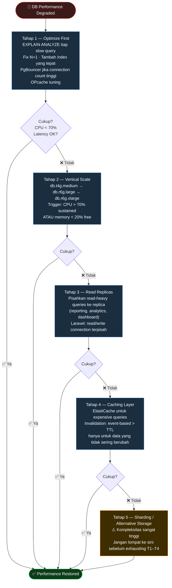

# H. Performance, Capacity, dan Operational Trade-off

> Bottleneck performance di production bukan selalu di tempat yang kita asumsikan. Satu-satunya cara mengetahui di mana bottleneck sesungguhnya adalah dengan data — bukan intuisi. Dokumen ini membahas pendekatan sistematis untuk mendiagnosa, mengambil keputusan, dan mengelola pertumbuhan kapasitas.

----------

## 1. Mendiagnosa Bottleneck: Framework "USE" dan "RED"

Sebelum mengambil tindakan apapun, kita perlu tahu jenis bottleneck yang dihadapi.

**USE Method**  (untuk resource-level diagnosis):

-   **U**tilization: Seberapa sibuk resource ini? (%)
-   **S**aturation: Seberapa banyak work yang queued/waiting?
-   **E**rrors: Apakah ada error yang terjadi?

**RED Method**  (untuk service-level diagnosis):

-   **R**ate: Berapa banyak request per second?
-   **E**rrors: Berapa error rate?
-   **D**uration: Berapa latency?

```mermaid
flowchart TD
    Start(["⚠️ Latency Tinggi"])

    Q1{"Error rate\ntinggi juga?"}

    subgraph dep["Downstream Dependency Failure"]
        D1["🗄️ DB slow query?"]
        D2["⚡ Redis timeout?"]
        D3["🌐 External API down?"]
    end

    Q2{"CPU tinggi?"}
    Q3{"Memory tinggi?"}
    Q4{"DB connections\nexhausted?"}
    Q5["🌐 Network latency\natau cold start"]

    CPU["⚙️ Compute-bound\nCek: inefficient algorithm,\nN+1 query"]
    MEM["💾 Memory-bound\nCek: memory leak,\nlarge payload"]
    POOL["🔌 Connection pool issue\nCek: connection leak,\npool size terlalu kecil"]

    Start --> Q1
    Q1 -->|"✅ Ya"| dep
    Q1 -->|"❌ Tidak"| Q2
    Q2 -->|"✅ Ya"| CPU
    Q2 -->|"❌ Tidak"| Q3
    Q3 -->|"✅ Ya"| MEM
    Q3 -->|"❌ Tidak"| Q4
    Q4 -->|"✅ Ya"| POOL
    Q4 -->|"❌ Semua normal"| Q5

    style Start fill:#3d1a1a,color:#fff,stroke:#f44336
    style dep fill:#1a2e40,stroke:#4a90d9
    style CPU fill:#1a3d1a,color:#fff,stroke:#4caf50
    style MEM fill:#1a3d1a,color:#fff,stroke:#4caf50
    style POOL fill:#1a3d1a,color:#fff,stroke:#4caf50
    style Q5 fill:#2d2d1a,color:#fff,stroke:#ffc107

```



----------

## 2. Penyebab Bottleneck yang Paling Umum (dan Sering Diabaikan)

### N+1 Query Problem

**Symptom:**  Latency meningkat linear dengan jumlah data yang diambil.  
**Diagnosis:**  Database slow query log menunjukkan banyak query identik dalam satu request.

```php
// ❌ Bad case — N+1: 1 query untuk orders + N queries untuk tiap user
$orders = Order::all();
foreach ($orders as $order) {
    echo $order->user->name; // Query baru per order
}
// 200 orders × 4ms/query = 800ms total

// ✅ Fix — Eager loading: selalu 2 queries, berapapun jumlah orders
$orders = Order::with('user')->get();
// 200 orders = 23ms total — improvement 35×

```

### Database Connection Pool Exhaustion

**Symptom:**  Error 500 spike tiba-tiba tanpa deployment; resolves sendiri setelah beberapa menit.  
**Diagnosis:**  `pg_stat_activity`  menunjukkan banyak connections di state  `idle in transaction`.  
**Root cause:**  Connection tidak di-release karena exception handling yang tidak proper.

```sql
-- Diagnosis: query ke pg_stat_activity untuk melihat connection states
SELECT state, count(*), max(now() - state_change) AS longest
FROM pg_stat_activity
WHERE datname = 'myapp_production'
GROUP BY state
ORDER BY count DESC;
-- Jika 'idle in transaction' count tinggi → connection leak confirmed

```

```ini
# postgresql.conf — fix agar stale connections di-kill otomatis
statement_timeout                  = '30s'   # Kill query yang berjalan > 30 detik
idle_in_transaction_session_timeout = '60s'  # Kill connection idle in transaction > 60 detik
lock_timeout                       = '5s'    # Fail fast, jangan tunggu deadlock

```

### PHP OPcache Misconfiguration

**Symptom:**  Latency tinggi tapi CPU normal; setelah container restart membaik sesaat lalu naik lagi.  
**Diagnosis:**  OPcache miss rate tinggi — setiap request menyebabkan  `stat()`  syscall untuk setiap file PHP.

```ini
; php.ini — OPcache config yang benar untuk production
opcache.enable                = 1
opcache.memory_consumption    = 256     ; MB — default 128 sering tidak cukup untuk Laravel
opcache.max_accelerated_files = 20000   ; Harus lebih besar dari jumlah file PHP di project
opcache.validate_timestamps   = 0       ; WAJIB 0 di production
                                        ; nilai 1 = disk I/O stat() per request = bottleneck tersembunyi
opcache.revalidate_freq       = 0       ; Irrelevant karena validate_timestamps=0
opcache.fast_shutdown         = 1
opcache.interned_strings_buffer = 16    ; MB — buffer untuk interned strings
opcache.huge_code_pages       = 1       ; Gunakan HugePages jika tersedia di OS

```

> **Catatan:**  `validate_timestamps = 1`  di production adalah sumber bottleneck yang paling sering tidak terdeteksi karena tidak muncul di CPU atau memory metrics — hanya terlihat di latency yang sulit dijelaskan.

----------

## 3. Scaling: Kapan dan Bagaimana

### Horizontal vs. Vertical Scaling: Framework Keputusan

```mermaid
flowchart LR
    subgraph vertical["⬆️ Vertical Scaling — Scale Up"]
        V1["✅ Stateful services\n(DB, Cache)"]
        V2["✅ Bottleneck terisolasi\n(misal: butuh lebih banyak RAM)"]
        V3["❌ Ada ceiling — instance terbesar\nmemerlukan restart"]
        V4["❌ Tidak menambah\nfault tolerance"]
    end

    subgraph horizontal["↔️ Horizontal Scaling — Scale Out"]
        H1["✅ Stateless application tier\n(ECS Tasks, API servers)"]
        H2["✅ Fault tolerance —\nsatu instance down, lain tetap jalan"]
        H3["❌ Butuh: stateless app,\nshared session (Redis), distributed coordination"]
        H4["❌ Lebih banyak instance =\nlebih banyak operational overhead"]
    end

    Decision{"Stateful\nservice?"}
    Decision -->|"Ya"| vertical
    Decision -->|"Tidak"| horizontal

    style vertical fill:#1a2e40,stroke:#4a90d9
    style horizontal fill:#1a3d1a,stroke:#4caf50
    style Decision fill:#2c3e50,color:#fff,stroke:#7f8c8d

```



### ECS Auto Scaling (Application Tier)

```hcl
# Terraform — ECS Service Auto Scaling

resource "aws_appautoscaling_target" "api" {
  max_capacity       = 20
  min_capacity       = 2
  resource_id        = "service/myapp-production/myapp-api"
  scalable_dimension = "ecs:service:DesiredCount"
  service_namespace  = "ecs"
}

# Scale out berdasarkan CPU
resource "aws_appautoscaling_policy" "cpu_scale_out" {
  name               = "cpu-scale-out"
  policy_type        = "TargetTrackingScaling"
  resource_id        = aws_appautoscaling_target.api.resource_id
  scalable_dimension = aws_appautoscaling_target.api.scalable_dimension
  service_namespace  = aws_appautoscaling_target.api.service_namespace

  target_tracking_scaling_policy_configuration {
    target_value       = 65.0  # Scale out saat CPU rata-rata > 65%
    # 65% dipilih (bukan 80%) untuk memberikan headroom sebelum saturation.
    # Scale out event membutuhkan 1-3 menit; tanpa headroom, kita scale out
    # setelah user sudah merasakan degradasi.
    
    scale_in_cooldown  = 300  # 5 menit: tunggu sebelum scale in
    scale_out_cooldown = 60   # 1 menit: scale out lebih agresif

    predefined_metric_specification {
      predefined_metric_type = "ECSServiceAverageCPUUtilization"
    }
  }
}

# Scale out berdasarkan ALB request count (leading indicator yang lebih baik dari CPU)
resource "aws_appautoscaling_policy" "request_count_scale_out" {
  name               = "request-count-scale-out"
  policy_type        = "TargetTrackingScaling"
  resource_id        = aws_appautoscaling_target.api.resource_id
  scalable_dimension = aws_appautoscaling_target.api.scalable_dimension
  service_namespace  = aws_appautoscaling_target.api.service_namespace

  target_tracking_scaling_policy_configuration {
    target_value = 1000  # 1000 requests per menit per task
    # ALBRequestCountPerTarget: lebih baik dari CPU karena ini leading indicator.
    # CPU meningkat SETELAH request meningkat; request count meningkat BERSAMAAN
    # dengan traffic spike.

    predefined_metric_specification {
      predefined_metric_type = "ALBRequestCountPerTarget"
      resource_label         = "${var.alb_arn_suffix}/${var.target_group_arn_suffix}"
    }
  }
}

```

### Database Scaling: Strategi Bertahap



----------

## 4. Cost-Performance Trade-off: Keputusan yang Konkret

### Spot Instance untuk Worker Services

```hcl
# Background workers (queue processing) adalah kandidat ideal untuk Spot Instance:
# - Interruptible (jika Spot di-terminate, job bisa di-retry)
# - Tidak perlu high availability individual (queue memberikan durability)
# - Cost saving: 60-80% vs. On-Demand

resource "aws_ecs_capacity_provider" "spot" {
  name = "spot-worker"

  auto_scaling_group_provider {
    auto_scaling_group_arn = aws_autoscaling_group.worker_spot.arn
    
    managed_scaling {
      status                    = "ENABLED"
      target_capacity           = 80  # Target 80% utilized (buffer untuk burst)
      minimum_scaling_step_size = 1
      maximum_scaling_step_size = 5
    }
  }
}

# API service menggunakan On-Demand (tidak interruptible)
# Worker service menggunakan Spot (interruptible, retry-able)
# Catatan: Jika worker job tidak idempotent, jangan gunakan Spot.

```

### Rightsizing: Audit Bulanan

```bash
# Script: identify over-provisioned ECS tasks
# Jalankan setelah 4 minggu production data tersedia

aws cloudwatch get-metric-statistics \
  --namespace AWS/ECS \
  --metric-name CPUUtilization \
  --dimensions Name=ClusterName,Value=myapp-production \
  --start-time $(date -d '30 days ago' -u +%Y-%m-%dT%H:%M:%SZ) \
  --end-time $(date -u +%Y-%m-%dT%H:%M:%SZ) \
  --period 3600 \
  --statistics Average,Maximum \
  --output table

# Jika CPU average < 20% selama 30 hari:
# → Task over-provisioned; reduce CPU reservation
# Jika CPU maximum < 40%:
# → Task significantly over-provisioned; consider halving the allocation
# Jika CPU average > 60%:
# → Approaching saturation; consider scaling up atau horizontal scaling

```

### Cold Start Mitigation

```
Masalah: ECS container yang baru di-spawn membutuhkan waktu untuk "warm up"
         (PHP OPcache compilation, connection pool establishment, cache warming)
         selama waktu ini, latency tinggi.

Solusi 1: Keep minimum capacity > 0 (jangan scale ke 0 di production)
  Biaya: ~$30-50/bulan untuk 1 task yang selalu running
  Benefit: Tidak ada cold start saat traffic tiba-tiba naik

Solusi 2: Predictive scaling berdasarkan scheduled events
  Jika traffic peak sudah bisa diprediksi (misal: tiap hari 09:00-10:00):
  aws application-autoscaling put-scheduled-action \
    --service-namespace ecs \
    --scalable-dimension ecs:service:DesiredCount \
    --resource-id service/myapp-production/myapp-api \
    --scheduled-action-name morning-scale-out \
    --schedule "cron(0 1 * * ? *)" \  # 01:00 UTC = 08:00 WIB
    --scalable-target-action MinCapacity=5,MaxCapacity=20

Solusi 3: Health check start period yang memadai
  --health-check-grace-period 60
  Mencegah ALB menandai container baru sebagai unhealthy sebelum fully initialized

```

----------

## 5. Capacity Planning: Proaktif bukan Reaktif

```
Weekly metrics review (setiap Senin, 30 menit):
  - CPU dan memory trend 7 hari terakhir
  - Database storage growth rate (project: kapan kita hit 80%?)
  - Request count trend
  - Error budget consumption

Monthly capacity review:
  - Trend 4 minggu terakhir
  - Upcoming events yang akan meningkatkan traffic
  - Cost per request trend (apakah cost-efficiency membaik atau memburuk?)
  - Evaluate apakah ada rightsizing opportunity

Kapasitas minimum yang harus selalu tersedia:
  Application: 30% headroom dari peak daily traffic
  Database CPU: Tidak boleh melebihi 60% sustained
  Database storage: Alert di 70%, scale di 80%
  Cache: Hit rate harus > 80%; jika turun, investigate TTL dan eviction policy

```

----------

_Performance engineering yang baik adalah disiplin yang berkelanjutan — bukan sprint satu kali yang dilakukan saat sistem sudah dalam kondisi krisis. Sistem yang dimonitor dengan baik memberikan sinyal jauh sebelum degradasi mencapai user._
